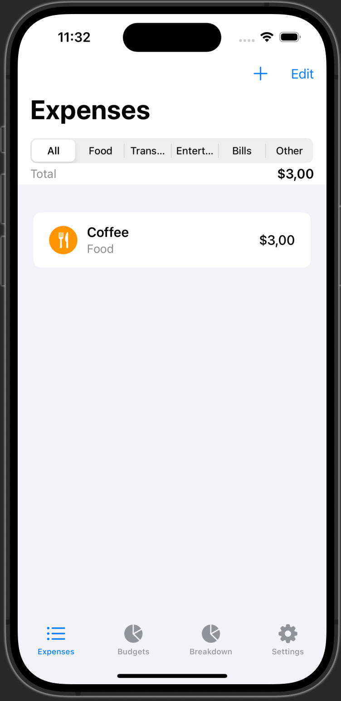
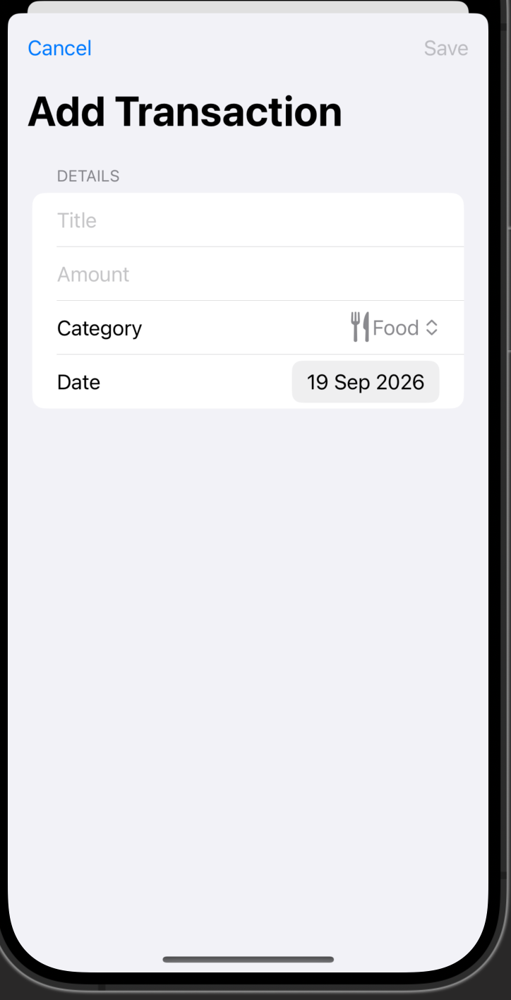
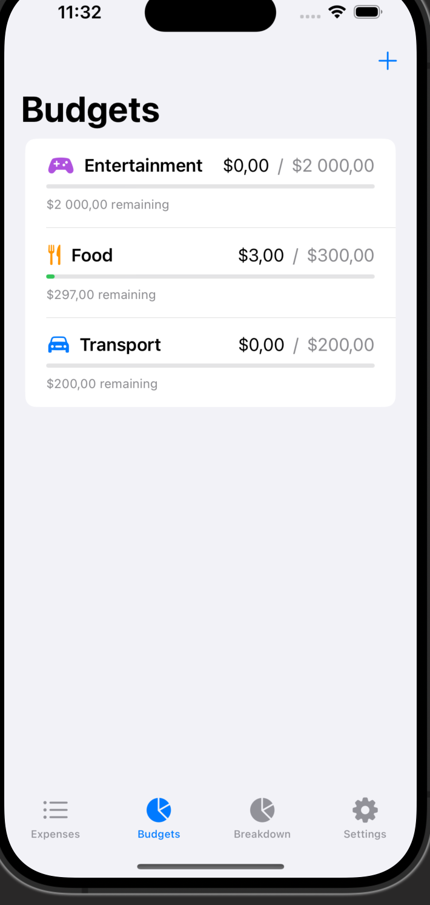

# ExpenseTracker

A native iOS expense-tracking app built with SwiftUI and Core Data, focused on clean architecture, testability, and a polished user experience.


## Screenshots

| Expenses | Add Transaction | Budgets |
|---|---|---|
|  |  |  |

## Features

- **Expense tracking** — add, edit, delete, and categorize transactions
- **Budgets** — set monthly limits per category with live spend tracking and over-budget warnings
- **Dark mode** — full support via a dedicated Settings tab and app-wide theme
- **Smooth UX** — spring animations, haptic feedback, and animated list transitions
- **Onboarding flow** — a first-launch walkthrough of the app's core features
- **Centralized error handling** — a typed `AppError` enum surfaces clear, consistent error messages across the app
- **Automated testing** — unit tests for view models/repositories and UI tests (XCUITest) covering core user flows
- **CI/CD** — every push and pull request is built and tested on an iOS Simulator via GitHub Actions

## Tech Stack

- **UI:** SwiftUI
- **Persistence:** Core Data
- **Reactivity:** Combine
- **Architecture:** MVVM + Repository pattern with dependency injection
- **Testing:** XCTest (unit tests) + XCUITest (UI tests)
- **Code quality:** SwiftLint
- **CI/CD:** GitHub Actions (macOS runner, iOS Simulator)

## Architecture

The app follows an MVVM + Repository pattern, keeping Core Data details out of the views entirely.

- **Views** render state and forward user intent to their ViewModel — no persistence logic lives here.
- **ViewModels** (`TransactionListViewModel`, `AddTransactionViewModel`, `BudgetViewModel`, …) hold `@Published` state and talk only to the `TransactionRepository` protocol.
- **Repository** abstracts Core Data behind a protocol, so ViewModels can be tested with a mock repository, and `CoreDataTransactionRepository` is the only place that touches `NSManagedObjectContext` directly.
- **AppError** is a shared, typed error enum (`LocalizedError`) that every layer's `catch` block maps into, so error messages are consistent and predictable throughout the app.

## Testing

- **Unit tests** cover ViewModels and the repository layer using an in-memory Core Data store.
- **UI tests** (XCUITest) cover the core end-to-end flows: adding a transaction, form validation, and setting a budget.
- Run tests locally with `Cmd+U` in Xcode, or via:
```bash
  xcodebuild test \
    -project ExpenseTracker.xcodeproj \
    -scheme ExpenseTracker \
    -destination 'platform=iOS Simulator,name=iPhone 16,OS=latest'
```

## Code Quality

SwiftLint is integrated with a project-specific `.swiftlint.yml` config. Run it locally with:

```bash
swiftlint lint
```

## Requirements

- Xcode 16+
- iOS 17.0+
- Swift 5.10+

## Getting Started

1. Clone the repo:
```bash
   git clone https://github.com/Irenapoghosian/expense-tracker.git
```
2. Open `ExpenseTracker.xcodeproj` in Xcode.
3. Build and run on a simulator or device (`Cmd+R`).

## Roadmap

- [ ] CSV export for transactions
- [ ] Search and sort in the transaction list
- [ ] Full accessibility support (Dynamic Type, VoiceOver labels)
- [ ] Privacy Policy page
- [ ] iCloud sync via CloudKit

## License

This project is for portfolio purposes.
